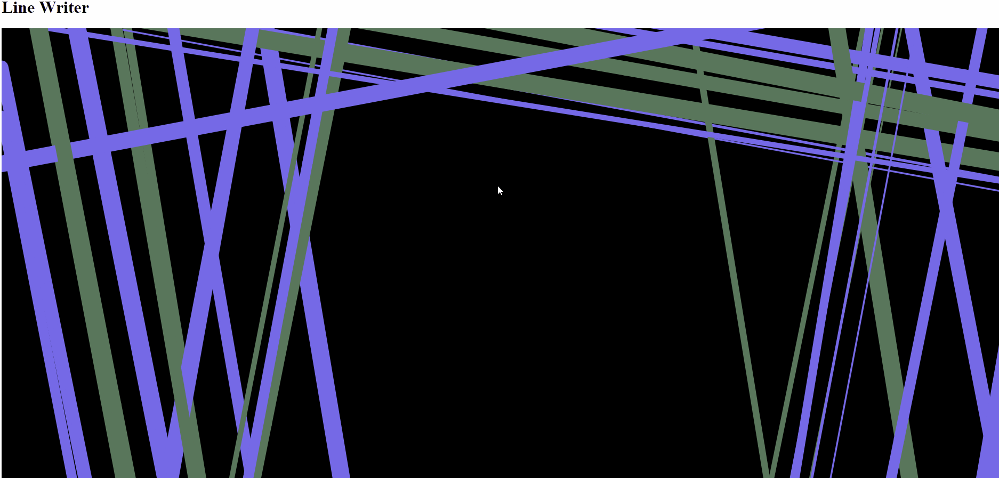

# line-writer
Line Writer using p5.js

<a href="https://glitch.com/edit/#!/join/b07b987c-311b-41a8-b4fd-fb616fce06e5">Remix on Glitch</a>

<h1>Features</h1>

<h2>
Randomly Placed Empty Space
</h2>

Every generation has one randomly positioned area on the canvas where lines are not allowed to intersect.  This space can be a placeholder for another object, always appropriately placed.

<h2>
Occasional Generation of Multiple Lines
</h2>

20% of lines get 1 or 2 child lines, which preserve the angle, but displace the original position and decrease in stroke weight.

<h2>
Calculation of Variances
</h2>

Lines are generated along two perpendicular axes with a specified degree of random variance. Colors are assigned randomly. Show penis.

