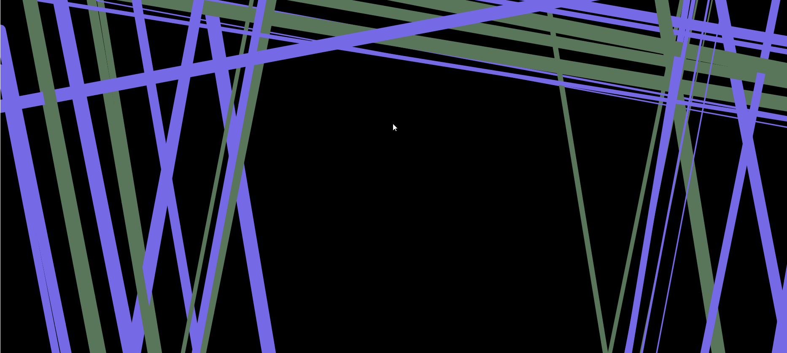

# line-writer

inspired by the artwork of Don Q. Hollis

<a href="https://sam-parsons-line-writer.glitch.me">Remix on Glitch</a>

## features

#### ``randomly placed focal point``

every generation has one randomly positioned area on the canvas where lines are not allowed to intersect.  this space can be a placeholder for another object, always appropriately placed.

#### ``occasional generation of multiple laterals``

20% of all lines drawn results in 1 or 2 "child" lines. each lines is thinner and drawn parralell, displaced from the parent line.

#### ``calculation of variances``

lines are generated along two perpendicular axes with a specified degree of random variance. color theme pairs are assigned randomly.
